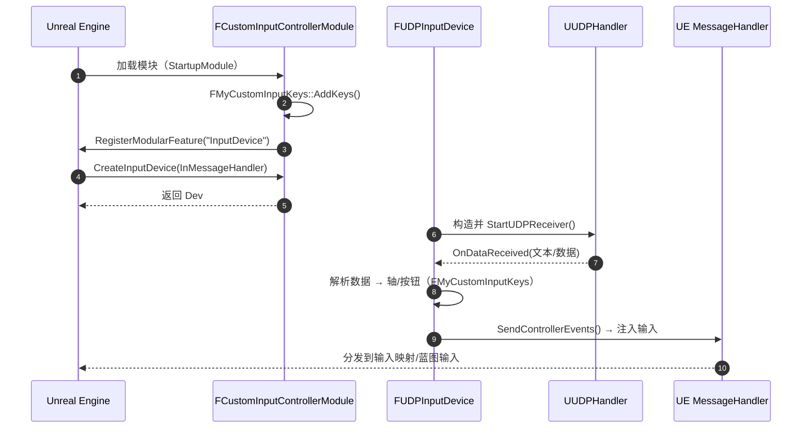
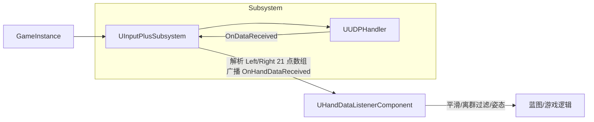
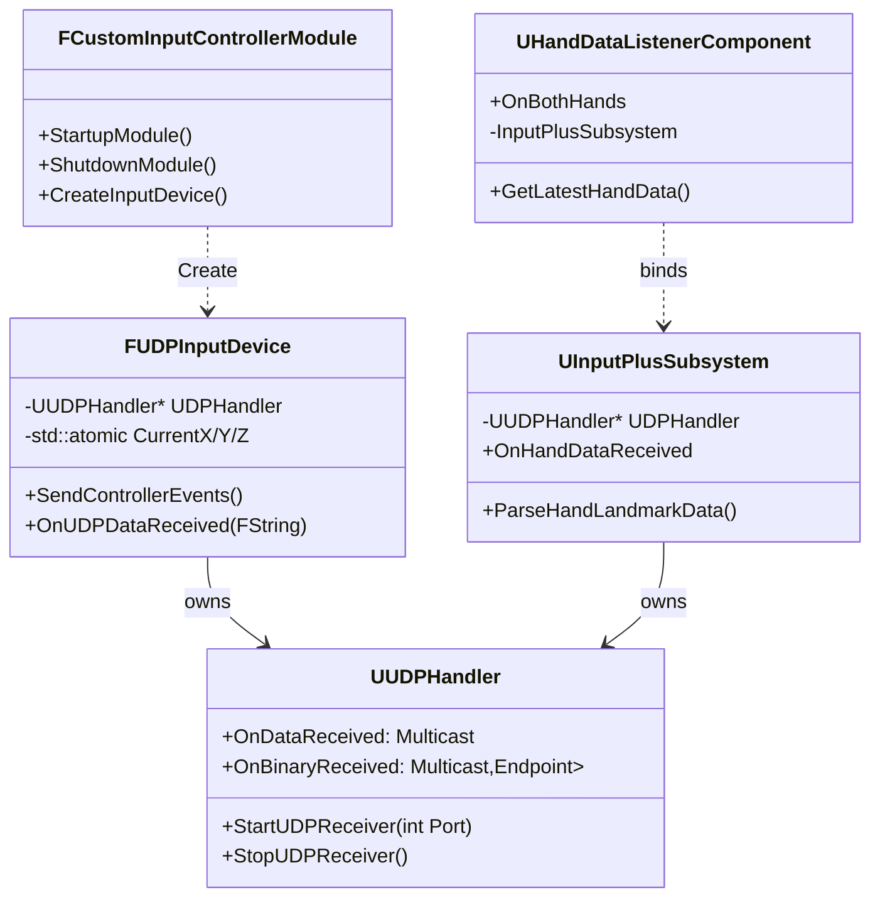

# CustomInputController 引用链与执行逻辑图

本文概述 Plugins/CustomInputController 模块的主要类、它们之间的引用关系（谁持有/调用谁），以及典型的运行时执行流程。并给出简要的时序/流程图，便于排查问题或对接蓝图。

相关源码位置（部分）：
- 模块入口
  - Source/CustomInputController/Public/CustomInputController.h
  - Source/CustomInputController/Private/CustomInputController.cpp
- 自定义输入键与输入设备
  - Source/CustomInputController/Public/CustomInputKey.h
  - Source/CustomInputController/Private/CustomInputKey.cpp
- UDP 接收器（通用、可供 C++/蓝图使用）
  - Source/CustomInputController/Public/UUDPHandler.h
  - Source/CustomInputController/Private/UUDPHandler.cpp
- 手部数据管线（蓝图友好）
  - Source/CustomInputController/Public/InputPlusSubsystem.h
  - Source/CustomInputController/Private/InputPlusSubsystem.cpp
  - Source/CustomInputController/Public/HandDataListenerComponent.h
  - Source/CustomInputController/Private/HandDataListenerComponent.cpp
- 其他（音频/网络等扩展，非本页核心）
  - NetMicWsSubsystem.h / StreamProcSoundWave.h / AudioStream* 等

---

## 一、核心职责概览
- FCustomInputControllerModule（模块）：
  - 在 StartupModule() 时注册自己为一个 IInputDeviceModule 的特性提供者；
  - 实现 CreateInputDevice()，用于生成自定义输入设备实例。
- FUDPInputDevice（输入设备，IInputDevice）：
  - 内部持有 UUDPHandler，用于监听 UDP 数据；
  - 将 UDP 文本/数值解析到自定义按键/轴（FMyCustomInputKeys）并经由 MessageHandler 注入到 UE 输入路由；
  - 提供 Tick/SendControllerEvents/SetMessageHandler 等 IInputDevice 接口。
- UUDPHandler（UDP 接收器，对外也可蓝图）：
  - 封装 Socket + FUdpSocketReceiver 线程；
  - 暴露 OnDataReceived（文本）与 OnBinaryReceived（二进制）委托；
  - StartUDPReceiver()/StopUDPReceiver() 控制生命周期。
- UInputPlusSubsystem（GameInstanceSubsystem，蓝图友好）：
  - 也持有一个 UUDPHandler，解析手势/手部关键点字符串；
  - 解析后以 OnHandDataReceived / OnHandDataReceivedDynamic 对外广播；
  - 提供 ParseHandLandmarkData/GetLatestHandData 等蓝图方法。
- UHandDataListenerComponent（Actor 组件，蓝图友好）：
  - BeginPlay 时查找并绑定 UInputPlusSubsystem 的事件；
  - 做平滑/离群点过滤/姿态计算等，将结果以 OnBothHands 广播或缓存供蓝图拉取。

---

## 二、引用链（谁引用/创建谁）

以“创建/持有”关系为主线：

- Unreal Engine → 加载插件模块 CustomInputController（.uplugin 配置）
  - FCustomInputControllerModule::StartupModule()
    - FMyCustomInputKeys::AddKeys() 注册自定义键/轴
    - IModularFeatures::RegisterModularFeature(IInputDeviceModule::GetModularFeatureName(), this)
      - Engine 通过该模块回调 CreateInputDevice()
        - CreateInputDevice() → new FUDPInputDevice(InMessageHandler)
          - FUDPInputDevice 构造：
            - 创建并持有 UUDPHandler（UDPHandler 成员）
            - 绑定 UUDPHandler::OnDataReceived → FUDPInputDevice::OnUDPDataReceived
            - 启动 UDP 监听（默认端口见实现，常见为 8091）

- 蓝图侧（手部数据链路）：
  - 关卡运行 → GameInstance 创建 UInputPlusSubsystem（引擎自动管理 Subsystem）
    - UInputPlusSubsystem::Initialize()
      - 创建并持有 UUDPHandler
      - 绑定 UUDPHandler::OnDataReceived → UInputPlusSubsystem::OnUDPDataReceivedInternal
  - 任意演员挂载 UHandDataListenerComponent：
    - BeginPlay → 在 GameInstance 中查找 UInputPlusSubsystem 并绑定它的 OnHandDataReceived 事件

可见：
- 输入事件链（键/轴）：Engine → Module → FUDPInputDevice → UUDPHandler → FUDPInputDevice::OnUDPDataReceived → MessageHandler → UE 输入系统
- 手势/手部链：GameInstance → UInputPlusSubsystem → UUDPHandler → 解析 → OnHandDataReceived → UHandDataListenerComponent → 平滑/过滤/姿态 → 蓝图

---

## 三、执行逻辑图

### 1) 模块与输入设备（键/轴）流程

### 2) 手部数据（蓝图链）流程

---

## 四、关键类关系图（静态）

---

## 五、数据格式与映射（摘要）
- FUDPInputDevice 侧：
  - 期望文本数据可解析为 3D 向量或按钮状态（见 CustomInputKey.cpp 的 ParseTextToXYZ 等）；
  - 将值写入 FMyCustomInputKeys 定义的 Key/Axis（Gaze_X、Gaze_Y、Gaze_Z、UDPButton1/2 等）。
- UInputPlusSubsystem 侧：
  - 期望字符串中包含左右手 21 点坐标序列（具体分隔符/顺序见 ParseHandLandmarkData/ParseSingleHandData 实现）；
  - 解析为 TArray<FVector>，并以委托广播，同时缓存供拉取。

---

## 六、典型调用与订阅（蓝图）
- 想要“输入映射层面的按键/轴”：
  - 在 Enhanced Input 或传统输入映射中绑定 FMyCustomInputKeys 中的键；
  - 由 FUDPInputDevice 注入事件，无需蓝图直接订阅。
- 想要“手部 21 点数据”：
  - 场景中添加 HandDataListenerComponent；
  - 在蓝图中绑定 OnBothHands 或定时调用 GetLatestHandData()；
  - 或直接在蓝图中访问 GameInstanceSubsystem: InputPlusSubsystem 提供的接口。

---

## 七、与其他扩展的关系（可选）
- NetMicWsSubsystem / AudioStream* 等文件属于音频网络/流式播放的独立功能，不参与自定义输入设备的创建流程；
- 如需在同一 UDP/WS 源输送“手势+音频”，可在更高层做编排，但它们与 FUDPInputDevice 的依赖相互独立。

---

## 八、排错提示
- 模块未被调用 CreateInputDevice：检查 .uplugin 是否启用、StartupModule 是否成功 RegisterModularFeature；
- 收不到 UDP：确认端口、防火墙、UUDPHandler::StartUDPReceiver 返回值和日志；
- 蓝图侧无手部事件：确认 UInputPlusSubsystem 初始化、UHandDataListenerComponent 的 BeginPlay 是否绑定成功；
- 键未注册：检查 FMyCustomInputKeys::AddKeys 是否在 StartupModule 执行；

---

最后更新：2025-11-03
