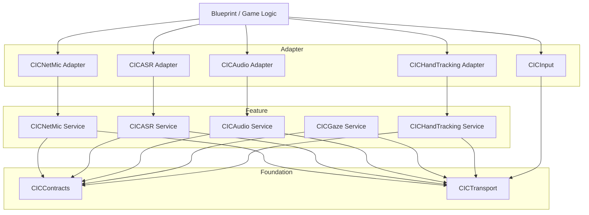
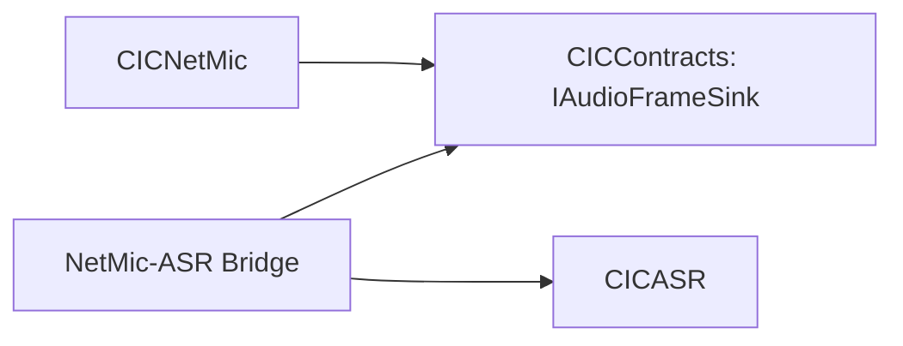

# CustomInputController 目标框架设计

本文档定义 CIC 从当前“大一统 Runtime 模块”演进为“低耦合、可演进、可裁剪”的目标框架。文档重点回答四个问题：

- 当前系统的核心耦合点在哪里。
- 目标模块应该如何划分。
- 模块之间允许和禁止出现哪些引用关系。
- 配置、兼容层、蓝图入口和运行时装配应如何组织。

本文档面向架构设计与重构评审，不直接描述每一处代码修改细节；具体落地步骤见 [CustomInputController_Modularization_Execution_Plan.md](CustomInputController_Modularization_Execution_Plan.md)。

---

## 1. 设计目标

### 1.1 核心目标

- 将 CIC 从单一 Runtime 模块拆分为职责清晰的功能模块。
- 将网络传输、业务功能、蓝图入口和兼容层分离，降低横向耦合。
- 让每个功能域可以独立演进、独立测试、按需启用。
- 将公共数据结构和接口前置到稳定层，避免 Feature 之间直接互相认识实现类。
- 为后续从“单插件多模块”进一步演进到“多插件”保留路径。

### 1.2 非目标

- 本阶段不追求一次性重写所有业务逻辑。
- 本阶段不要求完全移除所有历史蓝图 API。
- 本阶段不要求立即把 CIC 拆成多个独立插件。

---

## 2. 当前架构问题

当前 CIC 只有一个 Runtime 模块：

- 插件声明见 [CustomInputController.uplugin](../CustomInputController.uplugin)
- 模块依赖见 [Source/CustomInputController/CustomInputController.Build.cs](../Source/CustomInputController/CustomInputController.Build.cs)

这个单模块同时承载：

- 输入设备注入
- 通用 UDP 接收
- 手部追踪与消费组件
- 注视追踪
- 音频流组件与音频路由子系统
- NetMic WebSocket 会话
- FunASR 子系统与本地麦克风采集
- 通用 WebSocket 传输层
- 多组 DeveloperSettings

### 2.1 主要耦合问题

#### 问题 A：公共传输工具被放在业务目录下

- [Source/CustomInputController/Public/Input/UUDPHandler.h](../Source/CustomInputController/Public/Input/UUDPHandler.h) 本质上是通用 UDP 传输工具，但当前放在 Input 域下。
- [Source/CustomInputController/Public/Transport/CICWebSocketSession.h](../Source/CustomInputController/Public/Transport/CICWebSocketSession.h) 已经具备通用传输层特征，但尚未统一被所有 WebSocket 业务复用。

结果：

- 其他功能域一旦引用 UUDPHandler，看起来就像“依赖 Input 域”。
- 传输能力无法形成稳定底座。

#### 问题 B：Feature 之间横向直连

- [Source/CustomInputController/Public/HandTracking/HandDataListenerComponent.h](../Source/CustomInputController/Public/HandTracking/HandDataListenerComponent.h) 直接包含 InputPlusSubsystem。
- [Source/CustomInputController/Private/Audio/NetMicWsComponent.cpp](../Source/CustomInputController/Private/Audio/NetMicWsComponent.cpp) 直接依赖并调用 FunASRSubsystem。
- [Source/CustomInputController/Public/Audio/AudioStreamHttpWsComponent.h](../Source/CustomInputController/Public/Audio/AudioStreamHttpWsComponent.h) 为使用 AudioStreamPacket::FHeader 直接包含 AudioStreamHttpWsSubsystem。

结果：

- Feature 之间形成硬耦合。
- 很难独立迁移、独立替换或独立测试。

#### 问题 C：共享配置过于集中

- [Source/CustomInputController/Public/Core/CICRuntimeSettings.h](../Source/CustomInputController/Public/Core/CICRuntimeSettings.h) 同时承载输入、手部、注视、音频端口配置。
- [Source/CustomInputController/Public/Audio/AudioStreamSettings.h](../Source/CustomInputController/Public/Audio/AudioStreamSettings.h) 内部同时混有协议选择、Legacy 服务地址、Pure WebSocket 服务地址、组件默认参数、Opus 参数、NetMic 默认地址等多类职责。

结果：

- 多个模块回指同一个 Settings 类，形成隐性耦合。
- 某个域的配置项膨胀时，会拖累整个设置面板和读取逻辑。

#### 问题 D：兼容层与主路径混杂

- [Source/CustomInputController/Public/Audio/NetMicWsSubsystem.h](../Source/CustomInputController/Public/Audio/NetMicWsSubsystem.h) 已经被降级为兼容门面，但仍在主实现路径中被直接感知。

结果：

- 历史包袱会反向影响新架构。
- 迁移路径不清晰，容易让“兼容代码”继续长成“正式依赖”。

---

## 3. 架构原则

### 3.1 分层原则

目标框架采用四层结构：

1. Contracts 层：只放公共数据结构、协议对象、事件接口和轻量抽象。
2. Transport 层：只放 UDP / WebSocket 等通用传输能力。
3. Feature 层：每个功能域独立实现业务逻辑。
4. Adapter 层：蓝图组件、兼容门面、输入设备入口、采集器等对外适配对象。

### 3.2 依赖方向原则

只允许单向依赖：

- Adapter -> Feature
- Feature -> Contracts
- Feature -> Transport
- Transport -> Contracts（可选，仅当协议对象在 Contracts 中）

禁止出现：

- Feature A -> Feature B 的具体 Subsystem / Component 实现
- Public 头文件跨功能域包含另一个 Feature 的主头
- 兼容层反向成为核心业务依赖
- 共享设置类无限扩张为“总设置中心”

### 3.3 Public API 原则

- Public 头中优先使用前置声明，避免直接包含重型实现头。
- Public 层只暴露稳定类型与接口，不暴露内部协作细节。
- 跨模块通信优先使用接口、委托、消息对象，不直接 GetSubsystem 调实现类。

---

## 4. 目标模块划分

建议第一阶段采用“单插件多模块”方案，先建立低耦合结构，再决定是否继续拆成多插件。

### 4.1 模块清单

#### 1. CICContracts

职责：

- 放公共数据结构与轻量接口。
- 放跨域需要共享、但不属于具体业务实现的类型。

建议承载内容：

- Hand / Gaze / Audio 的共享数据对象
- 跨域委托与接口
- 音频包头和协议对象

典型候选：

- 从 InputPlusSubsystem 中拆出的 Hand 数据结构
- 从 AudioStreamHttpWsSubsystem 中拆出的 AudioStreamPacket::FHeader
- 将来为 NetMic -> ASR 解耦提供的音频帧消费接口

#### 2. CICTransport

职责：

- 提供通用 UDP / WebSocket 传输能力。
- 不承载具体业务语义。

建议承载内容：

- UUDPHandler
- FCICWebSocketSession

说明：

- UUDPHandler 当前位于 Input 目录，应迁移到 Transport。
- Audio、ASR、Gaze、Input、Hand 都应该依赖该模块，而不是彼此依赖。

#### 3. CICInput

职责：

- 提供输入设备模块入口。
- 注入自定义按键与轴。
- 负责将外部输入数据转换为 UE 输入事件。

建议承载内容：

- FCustomInputControllerModule 或其兼容壳
- FUDPInputDevice
- FMyCustomInputKeys

说明：

- 该模块应依赖 CICTransport 和输入配置，不应依赖 Hand、Audio、ASR。

#### 4. CICHandTracking

职责：

- 处理手部 UDP 数据解析、缓存和广播。
- 提供手部消费组件与运动学蓝图库。

建议承载内容：

- UInputPlusSubsystem 的手部能力部分
- UHandDataListenerComponent
- UHandKinematicsBPLibrary

说明：

- Hand 域不应该再依赖 Input 模块。
- 手部数据源与消费组件之间应通过数据对象和接口连接。

#### 5. CICGaze

职责：

- 处理注视追踪 UDP 数据接入、缓存和延迟估计。

建议承载内容：

- UCICGazeTrackingSubsystem
- UCICGazeTrackingSettings

说明：

- Gaze 模块应只依赖 CICTransport 和自己的 Settings。

#### 6. CICAudio

职责：

- 负责音频流业务控制、音频路由、本地播放和统计。

建议承载内容：

- UAudioStreamHttpWsComponent
- UAudioStreamHttpWsSubsystem
- UStreamProcSoundWave
- Audio Stream 相关 Settings

说明：

- Audio 组件与子系统之间应通过协议对象和注册接口协作。
- 组件 Public 头不应直接包含子系统实现头。

#### 7. CICASR

职责：

- 负责 FunASR 会话、任务状态、识别结果和本地麦克风采集。

建议承载内容：

- UFunASRSubsystem
- UFunASRMicComponent
- UFunASRSettings

说明：

- ASR 应只依赖 CICTransport 和自己的 Settings。
- ASR 不应认识 NetMic 的具体实现类。

#### 8. CICNetMic

职责：

- 负责网麦 WebSocket 会话、设备切换、录音状态恢复和音频帧输出。

建议承载内容：

- UNetMicWsComponent
- UNetMicWsSubsystem（兼容门面）

说明：

- NetMic 输出音频帧，不直接控制 ASR 任务。
- 如需联动 ASR，应通过接口绑定或桥接适配器完成。

---

## 5. 目标依赖图

### 5.1 依赖矩阵

| 模块 | Contracts | Transport | Input | Hand | Gaze | Audio | ASR | NetMic |
| --- | --- | --- | --- | --- | --- | --- | --- | --- |
| CICContracts | 否 | 否 | 否 | 否 | 否 | 否 | 否 | 否 |
| CICTransport | 可选 | 否 | 否 | 否 | 否 | 否 | 否 | 否 |
| CICInput | 是 | 是 | 否 | 否 | 否 | 否 | 否 | 否 |
| CICHandTracking | 是 | 是 | 否 | 否 | 否 | 否 | 否 | 否 |
| CICGaze | 是 | 是 | 否 | 否 | 否 | 否 | 否 | 否 |
| CICAudio | 是 | 是 | 否 | 否 | 否 | 否 | 否 | 否 |
| CICASR | 是 | 是 | 否 | 否 | 否 | 否 | 否 | 否 |
| CICNetMic | 是 | 是 | 否 | 否 | 否 | 否 | 否 | 否 |

注：

- 表中的“否”表示不允许出现对该模块实现层的直接依赖。
- 若 NetMic 与 ASR 需要协作，只能通过 Contracts 中的接口或桥接适配器进行。

---

## 6. 当前类到目标模块的归属建议

| 当前类/文件 | 当前位置 | 目标模块 | 备注 |
| --- | --- | --- | --- |
| FCustomInputControllerModule | Core | CICInput | 可保留旧模块名做兼容壳 |
| FUDPInputDevice | Core / Input | CICInput | 输入设备注入 |
| FMyCustomInputKeys | Core | CICInput | 自定义按键注册 |
| UUDPHandler | Input | CICTransport | 通用 UDP，应脱离 Input |
| FCICWebSocketSession | Transport | CICTransport | 通用 WS 传输层 |
| UInputPlusSubsystem | Input | CICHandTracking | 仅保留手部语义部分 |
| UHandDataListenerComponent | HandTracking | CICHandTracking | 手部消费组件 |
| UHandKinematicsBPLibrary | HandTracking | CICHandTracking | 手部运动学工具 |
| UCICGazeTrackingSubsystem | Input | CICGaze | 应独立出 Input 域 |
| UCICGazeTrackingSettings | Input | CICGaze | 与 Gaze 子系统同行 |
| UAudioStreamHttpWsComponent | Audio | CICAudio | 会话组件 |
| UAudioStreamHttpWsSubsystem | Audio | CICAudio | 路由与注册服务 |
| UStreamProcSoundWave | Audio | CICAudio | 播放适配 |
| UAudioStreamSettings | Audio | CICAudio | 后续再细分配置职责 |
| UFunASRSubsystem | ASR | CICASR | ASR 服务 |
| UFunASRMicComponent | ASR | CICASR | 本地采集适配 |
| UFunASRSettings | ASR | CICASR | ASR 配置 |
| UNetMicWsComponent | Audio | CICNetMic | 应从 Audio 域独立 |
| UNetMicWsSubsystem | Audio | CICNetMic | 兼容门面 |

---

## 7. 配置体系设计

配置拆分是低耦合架构的关键环节之一。

### 7.1 目标原则

- 每个模块拥有自己的 Settings 类。
- Settings 类只描述本模块运行参数，不承载跨域“总配置”。
- 若存在跨模块共享的环境参数，应单独定义 Foundation 级配置，而不是不断塞进 Core。

### 7.2 建议的设置划分

#### 1. CICInputRuntimeSettings

负责：

- InputDeviceUdpPort
- bAutoStartInputDeviceUdp

#### 2. CICHandTrackingSettings

负责：

- HandTrackingUdpPort
- bAutoStartHandTrackingUdp

#### 3. CICGazeSettings

负责：

- GazeUdpPort
- bAutoStartGazeListener

#### 4. CICAudioRuntimeSettings

负责：

- AudioSocketServerPortMin
- AudioSocketServerPortMax
- Audio Stream 默认协议与默认播放参数
- Opus 参数

#### 5. CICNetMicSettings

负责：

- DefaultNetMicWsUrl
- 自动重连默认策略

#### 6. CICASRSettings

负责：

- FunASR WebSocket 地址
- API Key
- WorkspaceId
- 识别模型与重连策略

### 7.3 对 AudioStreamSettings 的具体建议

当前 [Source/CustomInputController/Public/Audio/AudioStreamSettings.h](../Source/CustomInputController/Public/Audio/AudioStreamSettings.h) 同时管理：

- Legacy 协议地址
- Pure WebSocket 协议地址
- HTTP 路径
- 组件默认参数
- 编码参数
- NetMic 默认地址

建议按职责拆为两层：

#### 保留层：Audio Stream 主配置

保留：

- DefaultProtocolMode
- LegacyWsScheme / Host / PathPrefix
- PureWebSocketScheme / Host / Path
- DefaultHttpRunPath / StreamPath / EndStreamPath
- 组件和编码默认参数

#### 外移层：NetMic 专属配置

迁移出该类：

- DefaultNetMicWsUrl

理由：

- NetMic 是独立功能域，不应继续挂在 AudioStreamSettings 下。
- 否则 CICNetMic 会天然依赖 CICAudio 的设置模块，违反低耦合目标。

---

## 8. 跨模块通信设计

### 8.1 推荐方式

跨模块协作优先级如下：

1. 共享数据对象
2. 轻量接口
3. 委托 / 事件
4. 桥接适配器

不推荐：

- 直接 GetSubsystem 另一个功能域的实现类
- 在 Public 头中包含另一个模块的主头
- 直接把另一个域的子系统当“服务定位器”使用

### 8.2 NetMic 与 ASR 的目标关系

当前关系：

- NetMic 直接调用 UFunASRSubsystem 的 StartASR、StopASR、SendAudioFrame。

目标关系：

- NetMic 只负责产生音频帧、连接状态和设备状态。
- ASR 通过 IAudioFrameSink 或类似接口订阅音频帧。
- 若业务上仍需要“录音开始时自动启动 ASR”，该逻辑应进入桥接器或编排层，而不是留在 NetMic 模块内部。

目标示意：

### 8.3 HandTracking 与输入设备的目标关系

当前关系：

- HandDataListenerComponent 直接获取 UInputPlusSubsystem。

目标关系：

- HandDataListenerComponent 只依赖 Hand 数据源接口。
- Hand 数据源实现可以是 Subsystem，也可以是未来的其他 Provider。

---

## 9. 兼容策略

重构必须兼顾已有蓝图和配置。

### 9.1 模块兼容

- 第一阶段允许保留 CustomInputController 旧模块名，作为兼容入口或聚合壳。
- 新模块逐步迁移后，旧模块只保留 re-export、CoreRedirects 和兼容包装。

### 9.2 蓝图兼容

- 旧蓝图可继续通过兼容门面访问旧 API。
- 新功能和新增文档统一指向新模块入口。

### 9.3 配置兼容

- 旧 Settings 路径保留 CoreRedirects。
- ini 中旧键名在迁移窗口期内继续可读，再逐步下线。

---

## 10. 验收标准

目标框架落地后，应满足以下条件：

### 10.1 结构层

- 通用传输能力完全脱离业务域目录。
- Feature 之间不再直接引用彼此的 Subsystem / Component 实现。
- 兼容层不再出现在新路径的主依赖链中。

### 10.2 编译层

- 各模块 Build.cs 的依赖显著收缩。
- 不相关功能域不再被同一个重依赖集统一拖入。

### 10.3 运行时层

- 输入、手部、注视、音频、ASR、NetMic 可以独立初始化和验证。
- 移除某个业务域后，不影响其他域的基本运行。

### 10.4 可维护性层

- 新增一个功能域时，不需要修改多个无关模块的 Public 头。
- 文档能够说明每个模块的边界、入口和依赖方向。

---

## 11. 结论

CIC 的目标框架不是简单的“按目录拆文件”，而是要先建立稳定的底座和明确的依赖规则：

- Contracts 稳定共享对象和接口。
- Transport 提供纯传输能力。
- Feature 各自封装业务逻辑。
- Adapter 和 Compatibility 负责对外接入与历史兼容。

只要严格执行“Feature 不直接依赖其他 Feature 实现”的规则，CIC 就能从当前的大一统架构演进为低耦合、可裁剪、可维护的系统框架。